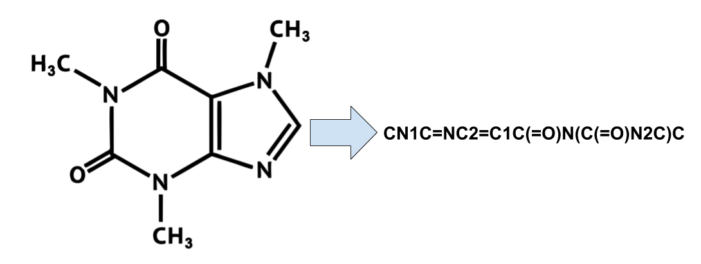
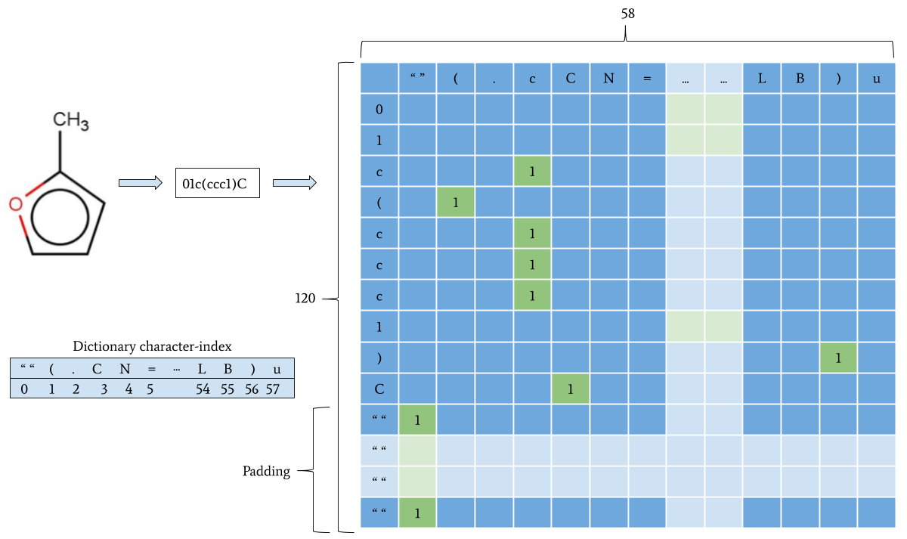
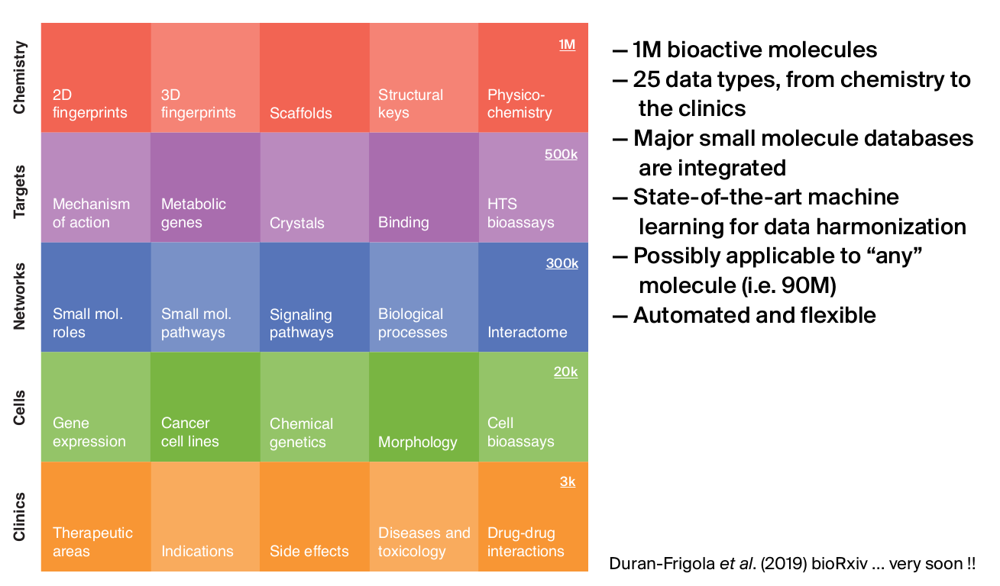
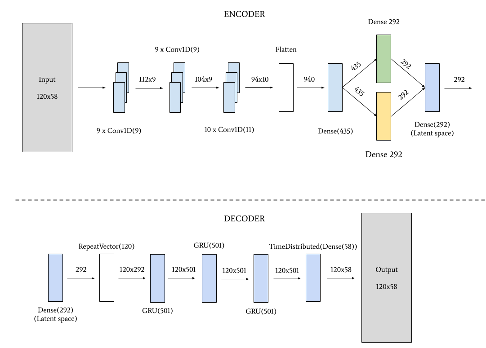
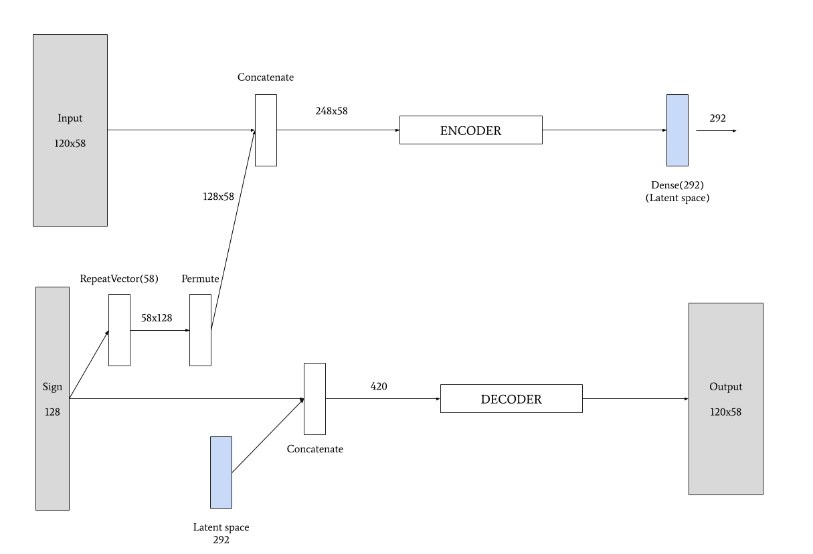
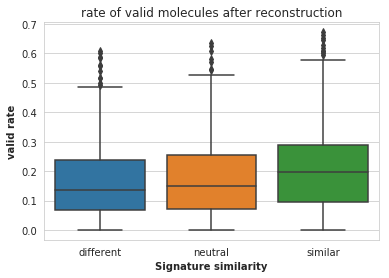
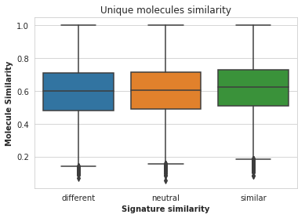
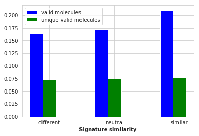
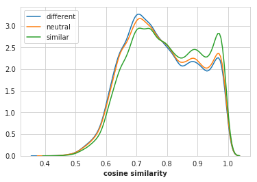
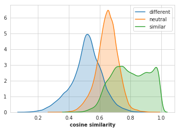

# Bioactivity-oriented de novo design of small molecules by conditional variational autoencoders

## Abstract
Deep generative networks are an emerging technology in drug discovery. Our work is divided in two parts. In the first one, we built a variational autoencoder (VAE) that is able to learn the grammar of the molecules, represent them in a latent space, and generate new ones. In the second one, we built and trained a conditional variational autoencoder (CVAE) that is capable of generating new molecules based on desired properties. We will see in detail the architecture of both models and how they were trained.
The molecule properties were provided by the Chemical Checker (CC), a resource of processed, harmonised and integrated small-molecule bioactivity data. We will generate different molecules with different target properties, and we will check how close the properties of the generated molecules are from the target ones. These properties are called signatures.
At the end of the project we sample CC signatures with different similarity to the input molecule signatures, and we show that the signatures of the molecules generated this way resemble the sampled signatures, meaning that we can generate new random molecules based on desired properties.

In this project we built a Conditional Variational autoencoder in order to generate new molecules with desired properties. These properties are the CC signatures (in particular we used the B4 signatures for training).

## Data preparation
In order to be fed to the algorithm, the molecules have to be processed as a sequence of characters. This is the case for the Simplified Molecular-Input Line-Entry System (SMILES) representation.

After that, we add white spaces until the string is 120 characters long, and then we apply the one-hot encoding technique.

The molecule properties are called signatures, and they're extracted from the Chemical Checker (CC). CC signatures are 128-dimensional vectors (embeddings) that encapsulate data of a certain kind by means of a two-step algorithm consisting, first, on the calculation of small-molecule similarities based on bioactivity data, followed by a network-embedding procedure performed on the resulting small-molecule similarity network.

We will use these signatures with their respective molecules in order to train the CVAE.

## Architecture

First let's take a look at the architecture of the encoder and the decoder:

This is how the variational autoencoder looks (VAE) without adding the molecule properties (signatures).

We then used the same encoder and decoder for the CVAE architecture, but with the following additions:

## Results

With the CVAE we achieved an accuracy of 99.5%, trained in a GPU-based cluster from the Barcelona Supercomputing Center (BSC).

Some results are as follows (note that we perform the experiment for 3 different type of target signatures: very similar to the input signature, very different, and neutral):

Ratio of valid generated molecules.

Similarity of the unique reconstructed molecules.

Unique valid molecules compared to the valid ones.

Cosine similarity between signatures of predicted molecules and input signatures.

Cosine similarity between signatures of predicted molecules and the signatures sampled for the decoding.

## Usage

There are two main files in the repository: `train.py` and `predict.py`. With the first one we can train the model, and with the second we can use an already trained model to generate new molecules.

### Training

`train.py` arguments:

  - `-s` or `--size`. Default: 400,000. Number of samples to use in the training process.
  - `-e` or `--epochs`. Default: 100. Number of epochs.
  - `-bs` or `--batch-size`. Default: 256. Batch size.
  - `--gpu`. Flag. If specified, it will use a GPU-optimized architecture.
  - `--loss`. Types: `binary` and `categorical`. Default: `binary`. Wether to use binary or categorical cross entropy.
  - `-lr` or `--learning-rate`. Default: `1e-4`. Learning rate.
  - `-mp' or ' --multi-processing`. Flag. If specified, it uses multithreading to preprocess the data.
  - `--use-generators`. Flag. If specified, it uses Keras' `fit_generator` instead of `fit`.
  - `-v` or `--verbose` Default: 2. Verbose level for the training process.
  - `-n` or `--name` Default: `"model"`. Name of the model (used in the saving process).
  
Example of usage: `python train.py -e 300 -bs 128 --gpu -mp -n model_1`

### Molecule generation

`predict.py` arguments:
  
  - `-m` or `--num-molecules`. Default: 0 (all)
  - `-r` or `--num-reconstructions`. Default: 100. Number of new molecules generated for each input molecule.
  - `-fix` or `--fix`. Default: `"signature"`. Technique used for the molecule generation. If the value is `"signature"`, the program will fix the signature of the molecule add will add noise to the latent space and generate new molecules from that. If the value is `"latent"`, the program will fix the latent space of the molecule and will sample signatures from the dataset.
  - `--gpu`. Flag. Wether to use a GPU-optimized architecture or not.
  - `-n` or `--name`. Default: `"model"`.
  
  Example of usage: `python predict.py -m 1000 -r 1000 --fix latent --gpu`